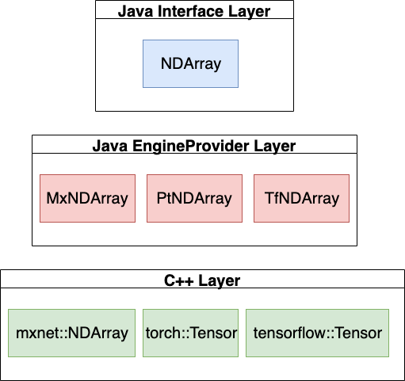

# 讲解 DJL 之 NDArray
> 本文适合有 Java 基础的人群


作者：**DJL-Lanking**

HelloGitHub 推出的[《讲解开源项目》](https://github.com/HelloGitHub-Team/Article)系列。有幸邀请到了亚马逊 + Apache 的工程师：Lanking（ https://github.com/lanking520 ），为我们讲解 DJL —— 完全由 Java 构建的深度学习平台。

## 前言


随着数据科学在生产中的应用逐步增加，使用N维数组灵活的表达数据变得愈发重要。我们可以将过去数据科学运算中的多维循环嵌套运算简化为简单几行。由于进一步释放了计算并行能力，这几行简单的代码运算速度也会比传统多维循环快很多。
这种数学计算的包已经成为于数据科学，图形学以及机器学习领域的标准。同时它的影响力还在不断的扩大到其他领域。

在 Python 的世界，调用 NDArray 的标准包叫做 NumPy 。
但是如今在 Java 领域中，并没有与之同样标准的库。为了给Java开发者创造同一种使用环境，亚马逊云服务开源了DJL，一个基于Java的深度学习库。
尽管它包含了深度学习模块，但是它最核心的 NDArray 系统可以被用作N维数组的标准。它具备优良的可扩展性，全平台支持，以及强大的后端引擎支持 (TensorFlow, PyTorch, Apache MXNet)。无论是 CPU 还是 GPU , PC 还是安卓，DJL 都可以轻而易举的完成任务。

> 官网：https://djl.ai/
>
> NDArray 文档: https://javadoc.io/doc/ai.djl/api/latest/ai/djl/ndarray/NDArray.html

在这个文章中，我们将带你了解 NDArray ，并且教你如何写与 Numpy 同样简单的 Java 代码以及如何将 NDArray 使用在现实中的应用之中。

## 安装DJL

可以通过下方的配置来配置你的 gradle 项目。或者，你也可以跳过设置直接使用我们在线 JShell 。

> 在线JShell链接: https://djl.ai/website/demo.html#jshell

```
plugins {
    id 'java'
}
repositories {                           
    jcenter()
}
dependencies {
    implementation "ai.djl:api:0.6.0"
    // PyTorch
    runtimeOnly "ai.djl.pytorch:pytorch-engine:0.6.0"
    runtimeOnly "ai.djl.pytorch:pytorch-native-auto:1.5.0"
}
```

然后，我们就可以开始上手写代码了。

## 基本操作

我们首先尝试建立一个 try block来包含我们的代码（如果使用在线 JShell 可跳过此步）：

```java
try(NDManager manager = NDManager.newBaseManager()) {
}
```

NDManager 是DJL中的一个 class 可以帮助管理 NDArray 的内存使用。通过创建 NDManager，我们可以更及时的对内存进行清理。当这个 block 里的任务运行完成时，内部产生的 NDArray 都会被清理掉。这个设计保证了我们在大规模使用 NDArray 的过程中，可以通过清理其中的 NDManager 来更高效的利用内存。

> NDManager 文档链接: https://javadoc.io/doc/ai.djl/api/latest/ai/djl/ndarray/NDManager.html

为了做对比，我们可以参考 NumPy 在 Python 之中的应用。

```python
import numpy as np
```

### 创建NDArray

`ones` 是一个创建全是1的N维数组操作.

**Python (Numpy)**

```python
nd = np.ones((2, 3))
"""
[[1. 1. 1.]
 [1. 1. 1.]]
"""
```

**Java (DJL NDArray)**

```java
NDArray nd = manager.ones(new Shape(2, 3));
/*
ND: (2, 3) cpu() float32
[[1., 1., 1.],
 [1., 1., 1.],
]
*/
```

你也可以尝试生成随机数。比如我们需要生成一些从0到1的随机数：

**Python (Numpy)**

```python
nd = np.random.uniform(0, 1, (1, 1, 4))
# [[[0.7034806  0.85115891 0.63903668 0.39386125]]]
```

**Java (DJL NDArray)**

```java
NDArray nd = manager.randomUniform(0, 1, new Shape(1, 1, 4));
/*
ND: (1, 1, 4) cpu() float32
[[[0.932 , 0.7686, 0.2031, 0.7468],
 ],
]
*/
```

这只是简单演示一些常用功能。现在 NDManager 支持多达20种在 NumPy 中 NDArray 创建的方法。

> NDManager 文档：https://javadoc.io/doc/ai.djl/api/latest/ai/djl/ndarray/NDManager.html

### 数学运算

你可以使用 NDArray 进行一系列的数学操作。假设你想做对数据做一个转置操作，然后对所有数据加一个数的操作。你可以参考如下的实现：

> 转置 (百度百科): https://baike.baidu.com/item/%E8%BD%AC%E7%BD%AE

**Python (Numpy)**

```python
nd = np.arange(1, 10).reshape(3, 3)
nd = nd.transpose()
nd = nd + 10
"""
[[11 14 17]
 [12 15 18]
 [13 16 19]]
"""
```

**Java (DJL NDArray)**

```java
NDArray nd = manager.arange(1, 10).reshape(3, 3);
nd = nd.transpose();
nd = nd.add(10);
/*
ND: (3, 3) cpu() int32
[[11, 14, 17],
 [12, 15, 18],
 [13, 16, 19],
]
*/
```

DJL 现在支持60多种不同的 NumPy 数学运算，基本涵盖了大部分的应用场景。

> NDArray文档: https://javadoc.io/doc/ai.djl/api/latest/ai/djl/ndarray/NDArray.html

### Get 和 Set

其中一个对于 NDArray 最重要的亮点就是它轻松简单的数据设置/获取功能。我们参考了 NumPy 的设计，将 Java 过去对于数据表达中的困难做了精简化处理。

假设我们想筛选一个N维数组所有小于10的数：

**Python (Numpy)**

```python
nd = np.arange(5, 14)
nd = nd[nd >= 10]
# [10 11 12 13]
```

**Java (DJL NDArray)**

```java
NDArray nd = manager.arange(5, 14);
nd = nd.get(nd.gte(10));
/*
ND: (4) cpu() int32
[10, 11, 12, 13]
*/
```

是不是非常简单？接下来，我们看一下一个稍微复杂一些的应用场景。假设我们现在有一个3x3的矩阵，然后我们想把第二列的数据都乘以2:

**Python (Numpy)**

```python
nd = np.arange(1, 10).reshape(3, 3)
nd[:, 1] *= 2
"""
[[ 1  4  3]
 [ 4 10  6]
 [ 7 16  9]]
"""
```

**Java (DJL NDArray)**

```
NDArray nd = manager.arange(1, 10).reshape(3, 3);
nd.set(new NDIndex(":, 1"), array -> array.mul(2));
/*
ND: (3, 3) cpu() int32
[[ 1,  4,  3],
 [ 4, 10,  6],
 [ 7, 16,  9],
]
*/
```

在上面的案例中，我们在 Java 引入了一个 NDIndex 的 class 。它复刻了大部分在 NumPy 中对于 NDArray 支持的 get/set 操作。只需要简单的放进去一个字符串表达式，开发者在 Java 中可以轻松玩转各种数组的操作。 

> NDIndex文档: https://javadoc.io/doc/ai.djl/api/latest/ai/djl/ndarray/index/NDIndex.html

## 现实中的应用场景

上述的操作对于庞大的数据集是十分有帮助的。现在我们来看一下这个应用场景：基于单词的分类系统训练。在这个场景中，开发者想要利用从用户中获取的数据来进行情感分析预测。
NDArray 被应用在了对于数据进行前后处理的工作中。

### 分词操作

在输入到 NDArray 数据前，我们需要对于输入的字符串进行分词操作并编码成数字。下面代码中看到的 tokenizer 是一个 Map<String, Integer>。它是一个单词到字典位置的映射。

```java
String text = "The rabbit cross the street and kick the fox";
String[] tokens = text.toLowerCase().split(" ");
int[] vector = new int[tokens.length];
/*
String[9] { "the", "rabbit", "cross", "the", "street",
"and", "kick", "the", "fox" }
*/
for (int i = 0; i < tokens.length; i++) {
    vector[i] = tokenizer.get(tokens[i]);
}
vector
/*
int[9] { 1, 6, 5, 1, 3, 2, 8, 1, 12 }
*/
```

### NDArray 处理

经过了编码操作后，我们创建了 NDArray 。 之后，我们需要转化数据的结构：

```java
NDArray array = manager.create(vector);
array = array.reshape(new Shape(vector.length, 1)); // form a batch
array = array.div(10.0);
/*
ND: (9, 1) cpu() float64
[[0.1],
 [0.6],
 [0.5],
 [0.1],
 [0.3],
 [0.2],
 [0.8],
 [0.1],
 [1.2],
]
*/
```

最后，我们将数据传入深度学习模型中。如果使用 Java 要达到这些需要更多的工作量：
如果我们需要实现类似于 reshape 的方法，我们需要创建一个N维数组：`List<List<List<...List<Float>...>>>` 来保证不同维度的可操作性。同时我们需要能够支持插入新的 `List<Float>` 来创建最终的数据格式。

## 为什么应该使用NDArray呢?

经过了这个教程，你应该获得了基本的NDArray在Java中的使用体验。但是这仍然只是表象，它的很多内在价值只有在生产环境中才能体现出来。总结一下，NDArray 具有如下几个优点：

* 易如反掌: 轻松使用超过 60+ 个在 Java 中的方式实现与 NumPy 相同的结果。
* 快如闪电: 具备各路深度学习框架加持，DJL NDArray 具备了各种硬件平台的加速，比如在 CPU 上的 MKLDNN 加速以及 GPU 上的 CUDA 加速。无论多大的数据集都可以轻松应对。
* 深度学习：同时具备高维数组支持，同时具备离散数组支持。你可以轻松的将 DJL 与其他大数据或者流数据平台结合起来应用：比如分布式处理的 Apache Spark 平台，以及 Apache Flink 流数据平台。为你现有的方案构建一层深度学习的中间件。

> 离散数组现在只包含 PyTorch 中的 COO 以及 MXNet 中的 CSR/Row_Sparse 。

## NDArray在DJL中的实现过程

你也许会好奇，NDArray究竟是如何在DJL之中构建的呢？接下来，我们会讲解一下NDArray在DJL内部中的架构。

### NDArray架构



如上图所示，NDArray 有三个关键的层。

界面层 (Interface) 包含了你所用到的 NDArray ，它只是一个 Java 的界面并定义了 NDArray 的输入输出结构。我们很仔细的分析了每一个方式的使用方法以便尽可能的将它们和用户的应用场景统一以及便于使用。

在引擎提供者层 (EngineProvider)，是DJL各种深度学习引擎为 NDArray 界面开发的包。这个层把原生的深度学习引擎算子表达映射在 NumPy 之上。这样经过这样一层转译，我们在不同引擎上看到 NDArray 的表现都是一致的而且同时兼顾了 NumPy 的表现。

在 C++ 层，为了更便于 Java 使用，我们构建了 JNI 和 JNA 暴露出 C/C++ 的等方法，它可以保证我们有足够的方法来构建 NDArray 所需要的功能。同时 C++ 与 Java 的直接调用也可以保证 NDArray 拥有最好的性能。

### 关于DJL


Deep Java Library (DJL) 是一个基于 Java 的深度学习框架，同时支持训练以及推理。 DJL 博取众长，构建在多个深度学习框架之上 (TenserFlow, PyTorch, MXNet, etc) 也同时具备多个框架的优良特性。你可以轻松使用 DJL 来进行训练然后部署你的模型。
它同时拥有着强大的模型库支持：只需一行便可以轻松读取各种预训练的模型。现在 DJL 的模型库同时支持高达70个来自 GluonCV, HuggingFace, TorchHub以及Keras 的模型。

> DJL主页: https://djl.ai/

NDArray 的到来帮助 DJL 成功转变为 Java 在深度学习领域中最好的工具。它具备平台自检测机制，无需任何额外设置，便可以在应用中构建基于 CPU/GPU 的代码。

在最新的版本中，DJL 0.6.0 添加了对于 MXNet 1.7.0, PyTorch 1.5.0 and TensorFlow 2.2.0 的支持。我们同时也添加了 ONNXRuntime 以及 PyTorch 在安卓平台的支持。

想了解更多或者有任何疑问，欢迎猛戳下面的链接：

- [GitHub](https://github.com/awslabs/djl)
- [Slack](https://join.slack.com/t/deepjavalibrary/shared_invite/zt-ar91gjkz-qbXhr1l~LFGEIEeGBibT7w)
- [知乎专栏](https://zhuanlan.zhihu.com/c_1255493231133417472)
